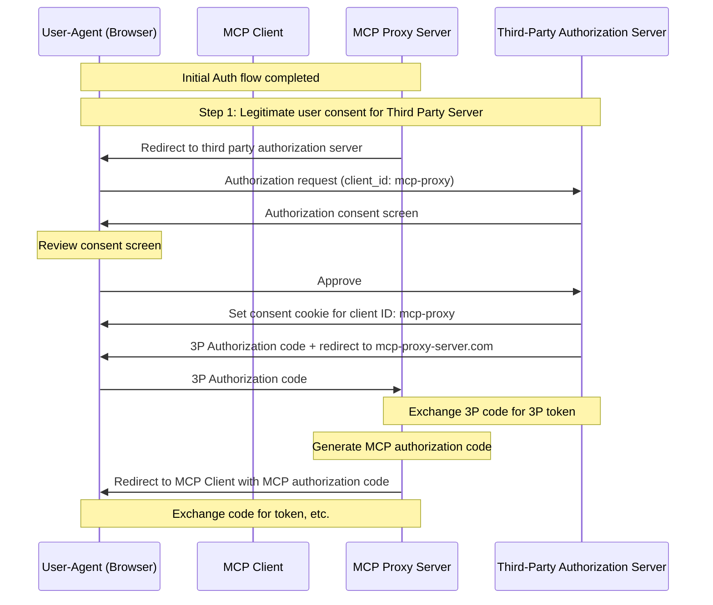
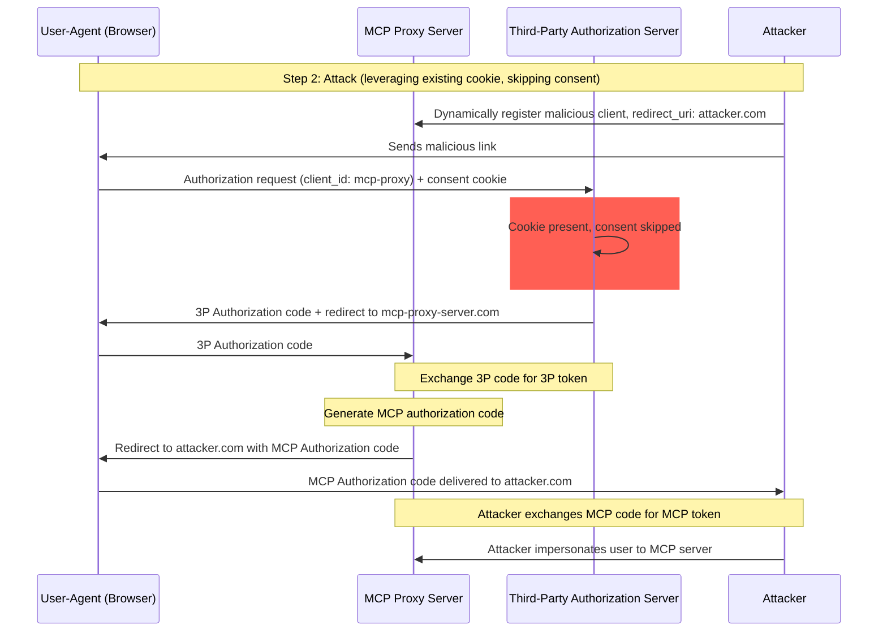
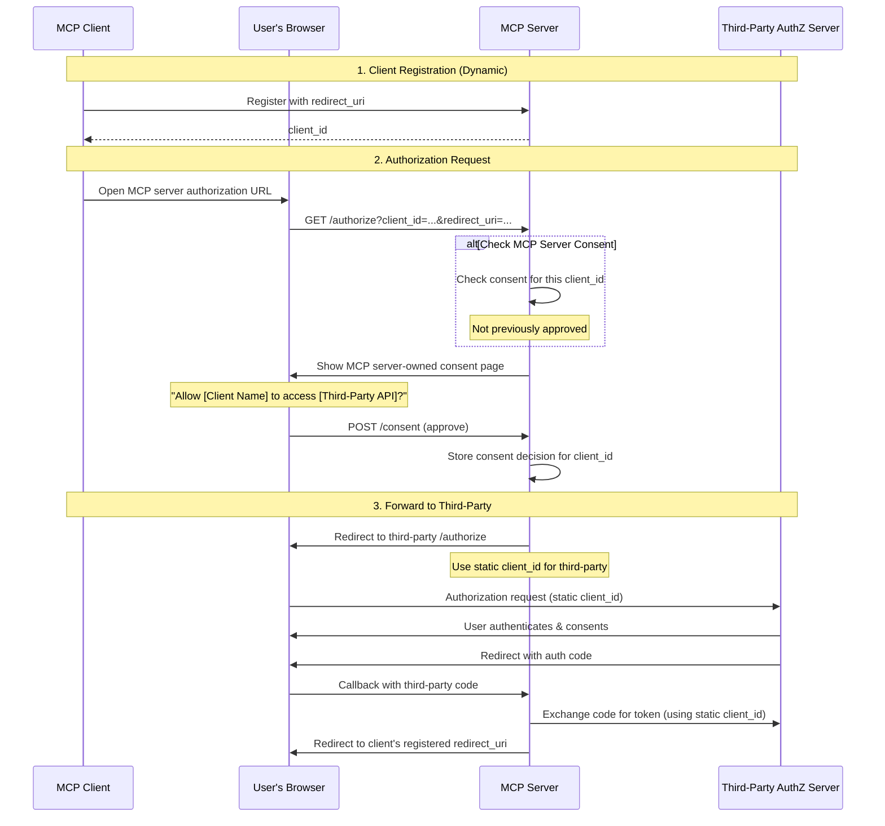

> Source: https://modelcontextprotocol.io/docs/2026-07-28/tutorials/security/security_best_practices.md
> Spec revision: 2026-07-28
> Retrieved: 2026-08-11
> PART 1 of the Security Best Practices page: Introduction, Confused Deputy Problem, Token Passthrough
> (verbatim slice of the source page, lines 11-353 of the full capture).

---

# Security Best Practices — Introduction, Confused Deputy Problem, Token Passthrough

> Security considerations, attack vectors, and best practices for MCP implementations

## Introduction

### Purpose and Scope

This document provides security considerations for the Model Context
Protocol (MCP), complementing the
[MCP Authorization](/specification/latest/basic/authorization)
specification. This document identifies security risks, attack vectors,
and best practices specific to MCP implementations.

The primary audience for this document includes developers implementing
MCP authorization flows, MCP server operators, and security
professionals evaluating MCP-based systems. This document should be read
alongside the MCP Authorization specification and
[OAuth 2.0 security best practices](https://datatracker.ietf.org/doc/html/rfc9700).

## Attacks and Mitigations

This section gives a detailed description of attacks on MCP
implementations, along with potential countermeasures.

### Confused Deputy Problem

Attackers can exploit MCP proxy servers that connect to third-party
APIs, creating
"[confused deputy](https://en.wikipedia.org/wiki/Confused_deputy_problem)"
vulnerabilities. This attack allows malicious clients to obtain
authorization codes without proper user consent by exploiting the
combination of static client IDs, dynamic client registration, and
consent cookies.

#### Terminology

**MCP Proxy Server**
: An MCP server that connects MCP clients to third-party APIs, offering
MCP features while delegating operations and acting as a single OAuth
client to the third-party API server.

**Third-Party Authorization Server**
: Authorization server that protects the third-party API. It may lack
dynamic client registration support, requiring the MCP proxy to use a
static client ID for all requests.

**Third-Party API**
: The protected resource server that provides the actual API
functionality. Access to this API requires tokens issued by the
third-party authorization server.

**Static Client ID**
: A fixed OAuth 2.0 client identifier used by the MCP proxy server when
communicating with the third-party authorization server. This Client ID
refers to the MCP server acting as a client to the Third-Party API. It
is the same value for all MCP server to Third-Party API interactions
regardless of which MCP client initiated the request.

#### Vulnerable Conditions

This attack becomes possible when all of the following conditions are
present:

* MCP proxy server uses a **static client ID** with a third-party
  authorization server
* MCP proxy server allows MCP clients to **dynamically register** (each
  getting their own client\_id)
* The third-party authorization server sets a **consent cookie** after
  the first authorization
* MCP proxy server does not implement proper per-client consent before
  forwarding to third-party authorization

#### Architecture and Attack Flows

##### Normal OAuth proxy usage (preserves user consent)

##### Malicious OAuth proxy usage (skips user consent)

#### Attack Description

When an MCP proxy server uses a static client ID to authenticate with
a third-party authorization server, the following attack becomes
possible:

1. A user authenticates normally through the MCP proxy server to access
   the third-party API
2. During this flow, the third-party authorization server sets a cookie
   on the user agent indicating consent for the static client ID
3. An attacker later sends the user a malicious link containing a
   crafted authorization request which contains a malicious redirect URI
   along with a new dynamically registered client ID
4. When the user clicks the link, their browser still has the consent
   cookie from the previous legitimate request
5. The third-party authorization server detects the cookie and skips the
   consent screen
6. The MCP authorization code is redirected to the attacker's server
   (specified in the malicious `redirect_uri` parameter during
   [dynamic client registration](/specification/latest/basic/authorization#dynamic-client-registration))
7. The attacker exchanges the stolen authorization code for access
   tokens for the MCP server without the user's explicit approval
8. The attacker now has access to the third-party API as the compromised
   user

#### Mitigation

To prevent confused deputy attacks, MCP proxy servers **MUST** implement
per-client consent and proper security controls as detailed below.

##### Consent Flow Implementation

The following diagram shows how to properly implement per-client consent
that runs **before** the third-party authorization flow:

##### Required Protections

**Per-Client Consent Storage**

MCP proxy servers **MUST**:

* Maintain a registry of approved `client_id` values per user
* Check this registry **before** initiating the third-party
  authorization flow
* Store consent decisions securely (server-side database, or server
  specific cookies)

**Consent UI Requirements**

The MCP-level consent page **MUST**:

* Clearly identify the requesting MCP client by name
* Display the specific third-party API scopes being requested
* Show the registered `redirect_uri` where tokens will be sent
* Implement CSRF protection (e.g., state parameter, CSRF tokens)
* Prevent iframing via `frame-ancestors` CSP directive or
  `X-Frame-Options: DENY` to prevent clickjacking

**Consent Cookie Security**

If using cookies to track consent decisions, they **MUST**:

* Use `__Host-` prefix for cookie names
* Set `Secure`, `HttpOnly`, and `SameSite=Lax` attributes
* Be cryptographically signed or use server-side sessions
* Bind to the specific `client_id` (not just "user has consented")

**Redirect URI Validation**

The MCP proxy server **MUST**:

* Validate that the `redirect_uri` in authorization requests exactly
  matches the registered URI
* Reject requests if the `redirect_uri` has changed without
  re-registration
* Use exact string matching (not pattern matching or wildcards)

**OAuth State Parameter Validation**

The OAuth `state` parameter is critical to prevent authorization code
interception and CSRF attacks. Proper state validation ensures that
consent approval at the authorization endpoint is enforced at the
callback endpoint.

MCP proxy servers implementing OAuth flows **MUST**:

* Generate a cryptographically secure random `state` value for each
  authorization request
* Store the `state` value server-side (in a secure session store or
  encrypted cookie) **only after** consent has been explicitly approved
* Set the `state` tracking cookie/session **immediately before**
  redirecting to the third-party identity provider (not before consent
  approval)
* Validate at the callback endpoint that the `state` query parameter
  exactly matches the stored value in the callback request's cookies or
  in the request's cookie-based session
* Reject any callback requests where the `state` parameter is missing
  or does not match
* Ensure `state` values are single-use (delete after validation) and
  have a short expiration time (e.g., 10 minutes)

The consent cookie or session containing the `state` value **MUST NOT**
be set until **after** the user has approved the consent screen at the
MCP server's authorization endpoint. Setting this cookie before consent
approval renders the consent screen ineffective, as an attacker could
bypass it by crafting a malicious authorization request.

### Token Passthrough

"Token passthrough" is an anti-pattern where an MCP server accepts
tokens from an MCP client without validating that the tokens were
properly issued *to the MCP server* and passes them through to the
downstream API.

An attacker can gain unauthorized access or otherwise compromise an
MCP server if the server accepts tokens issued for other resources.
This vulnerability has two critical dimensions:

1. **Audience validation failures.** When an MCP server doesn't verify
   that tokens were specifically intended for it (for example, via the
   audience claim, as mentioned in
   [RFC9068](https://www.rfc-editor.org/rfc/rfc9068.html)), it may
   accept tokens originally issued for other services. This breaks a
   fundamental OAuth security boundary, allowing attackers to reuse
   legitimate tokens across different services than intended.
2. **Token passthrough.** If the MCP server not only accepts tokens
   with incorrect audiences but also forwards these unmodified tokens
   to downstream services, it can potentially cause the
   ["confused deputy" problem](#confused-deputy-problem), where the
   downstream API may incorrectly trust the token as if it came from
   the MCP server or assume the token was validated by the upstream
   API.

#### Risks

Token passthrough is explicitly forbidden in the
[authorization specification](/specification/latest/basic/authorization)
as it introduces a number of security risks, that include:

* **Security Control Circumvention**
  * The MCP Server or downstream APIs might implement important security
    controls like rate limiting, request validation, or traffic
    monitoring, that depend on the token audience or other credential
    constraints. If clients can obtain and use tokens directly with the
    downstream APIs without the MCP server validating them properly or
    ensuring that the tokens are issued for the right service, they
    bypass these controls.
* **Accountability and Audit Trail Issues**
  * The MCP Server will be unable to identify or distinguish between MCP
    Clients when clients are calling with an upstream-issued access token
    which may be opaque to the MCP Server.
  * The downstream Resource Server's logs may show requests that appear
    to come from a different source with a different identity, rather
    than the MCP server that is actually forwarding the tokens.
  * Both factors make incident investigation, controls, and auditing
    more difficult.
  * If the MCP Server passes tokens without validating their claims
    (e.g., roles, privileges, or audience) or other metadata, a
    malicious actor in possession of a stolen token can use the server
    as a proxy for data exfiltration.
* **Trust Boundary Issues**
  * The downstream Resource Server grants trust to specific entities.
    This trust might include assumptions about origin or client behavior
    patterns. Breaking this trust boundary could lead to unexpected
    issues.
  * If the token is accepted by multiple services without proper
    validation, an attacker compromising one service can use the token
    to access other connected services.
* **Future Compatibility Risk**
  * Even if an MCP Server starts as a "pure proxy" today, it might need
    to add security controls later. Starting with proper token audience
    separation makes it easier to evolve the security model.

#### Mitigation

MCP servers **MUST NOT** accept any tokens that were not explicitly
issued for the MCP server.

